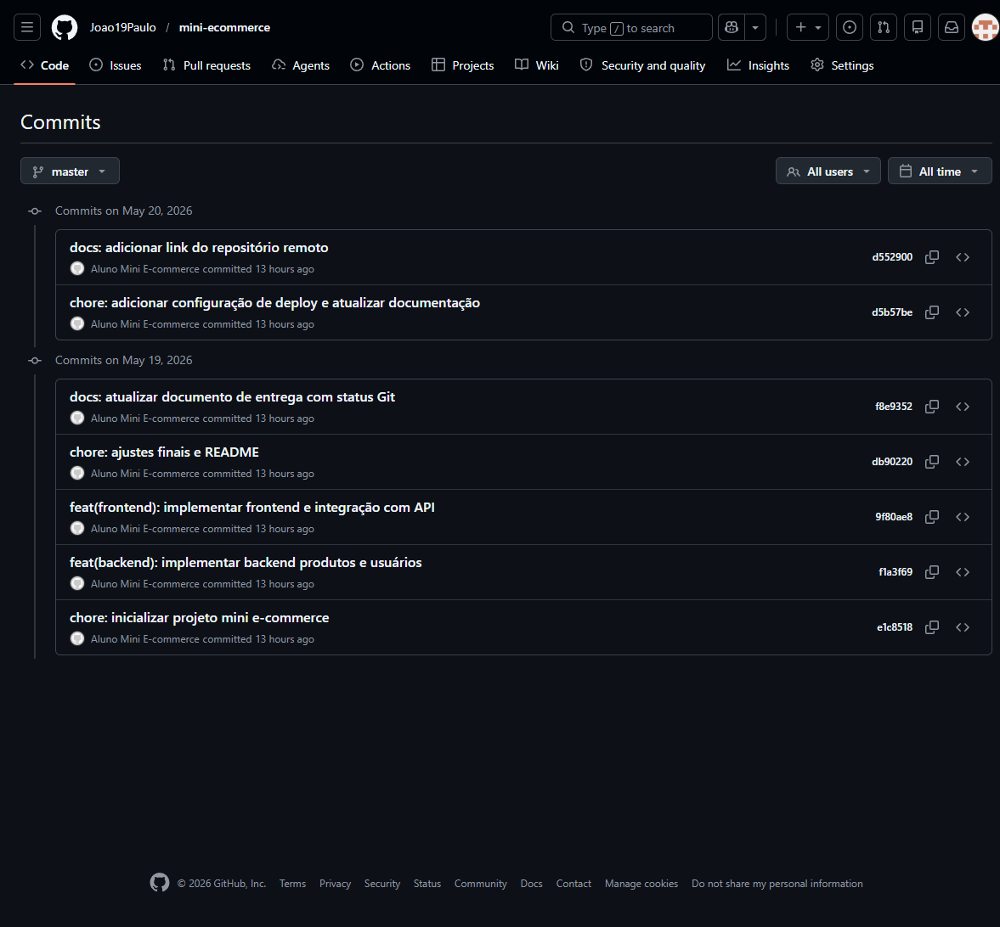
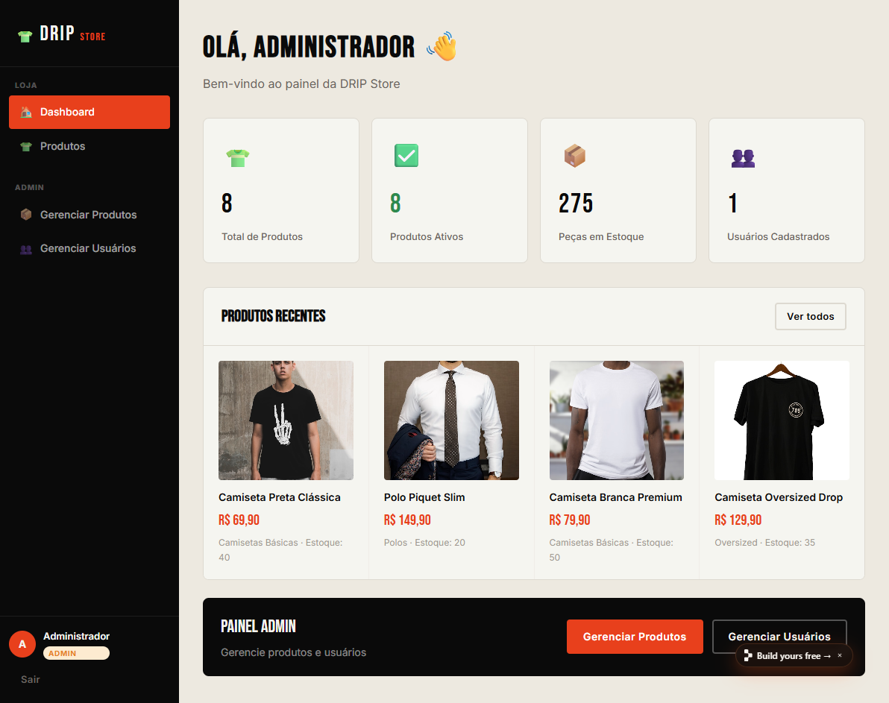

# Documento de Entrega

## a) Identificação
- Nome do aluno: João Paulo Gonçalves Vellasco Campos
- Turma: 5 periodo Sistemas da Informação
- Data: 18/05/2026

## b) Tecnologias utilizadas
- Frontend: React 18 + Vite + React Router
- Backend: Node.js + Express
- Banco de dados: NeDB (embedded)
- Autenticação: JWT + bcryptjs
- Estilo: CSS customizado
- Deploy: Replit (public)

## c) Evidências dos commits
- Histórico de commits criado e sincronizado com o GitHub.
- Commits recentes:
  - `a47582e` docs: atualizar documento de entrega com link do deploy Replit
  - `5275ec1` docs: atualizar documento de entrega e render.yaml com status de deploy
  - `d552900` docs: adicionar link do repositório remoto
  - `d5b57be` chore: adicionar configuração de deploy e atualizar documentação
  - `f8e9352` docs: atualizar documento de entrega com status Git
  - `db90220` chore: ajustes finais e README
- Print do histórico de commits: captura de tela do GitHub na página de commits do repositório.

- Print do deploy funcionando: captura de tela da aplicação pública carregada no Replit.

## d) Link do repositório GitHub
- https://github.com/Joao19Paulo/mini-ecommerce

## e) Link do deploy funcionando
- https://e9599c8a-6d65-4d9f-bc24-24ca6e44494d-00-184y9u7zo0kpy.riker.replit.dev

## f) Validação técnica
- Frontend: `npm --prefix frontend install` e `npm --prefix frontend run build` executados com sucesso.
- Backend: dependências instaladas e servidor iniciado em `http://localhost:3001`.
- Health check: `GET /api/health` retornou `{"status":"ok"}`.
- Deploy público confirmado em produção no Replit.
- CI/CD: workflow GitHub Actions criado em `.github/workflows/ci.yml` para instalar dependências e build do frontend.

## Observações importantes
- O projeto possui os requisitos principais implementados:
  - CRUD de produtos
  - CRUD de usuários
  - Integração frontend/backend por API
  - Persistência em banco de dados
  - Autenticação e autorização de perfis
  - Busca, filtros e paginação
  - Página de detalhe de produto com visualização completa
  - Página de detalhe de usuário para administrador
  - Upload local de imagem para produto via base64
- O backend está preparado para rodar em produção e servir o `frontend/dist` quando `NODE_ENV=production`.
- O deploy foi realizado com sucesso no Replit, sem necessidade de forma de pagamento.
- O Render foi tentado anteriormente, mas a conta exigia informação de pagamento para criar o serviço.
